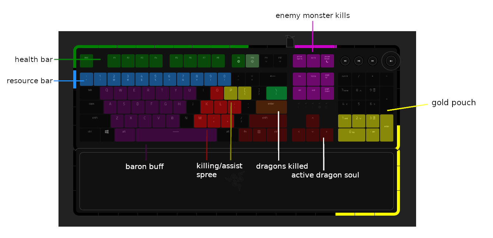

# Chroma League pre-2.0

> **NOTICE**
> 
> Due to a bug that Razer is "actively working on", 
> previous Java-based version of this project is not working.
> 
> This is a complete working port of old Chroma League 1.x
> 
> I am targeting to release it on the popular Overwolf platform 
> which will provide easy installation, updates and League of Legends integration. 
>
> Currently, if you want to run it, see the [Running](#running) section below.
>
> Due to extended validation of Riot/Overwolf I cannot come up with any ETA when it will be released on Overwolf. 
> 
> If you have any questions, feel free to drop the issue in GitHub.
 

Open-source Razer Chroma keyboard integration for League of Legends.

If you like this project, consider giving me a tip for all the hard work :)

[](https://www.paypal.com/cgi-bin/webscr?cmd=_donations&business=5JFBXY66RT8Z6&item_name=Chroma+League&currency_code=PLN)

## Introduction

Razer Chroma is a wonderful framework provided by [Razer](https://www.razer.com/)
for implementing custom LED animations for their peripherals.

Many applications/games have its official support but [League of Legends](https://leagueoflegends.com)
is not one of them.

So I designed my custom League of Legends Razer Chroma integration that I'm using daily playing games on Summoner's
Rift.

This end up with bigger project **Chroma League** which I'm sharing for all League of Legends players owning Razer
Chroma keyboards to enjoy the integrations

**Chroma League** is using
League's [Live Client Data Api](https://developer.riotgames.com/docs/lol#game-client-api_live-client-data-api)
exposed during game to fetch current game's state and react to the in-game events.

If you have any comments, suggestions, ideas, found a bug or just want to say hello please visit official thread at
Razer
Insider: [Chroma League - League of Legends integration for Razer Chroma](https://insider.razer.com/index.php?threads/chroma-league-league-of-legends-integration-for-razer-chroma.65412/)
.

## Overview



This is what basic in game HUD looks like on Chroma Keyboard. Certain in-game events will spawn additional animations.

## Requirements

* Windows
* League of Legends
* Razer Synapse 3 (with Chroma Connect module enabled)
* Chroma enabled keyboard

## Running

**Prerequisites:** [Node.js](https://nodejs.org/) must be installed.

1. Clone or download this repository
2. Install dependencies:
   ```
   npm install
   ```
3. Start the application:
   ```
   npm run dev:server
   ```

**Chroma League** will start and automatically detect when you join a League of Legends game.

## Compatibility

* runs on Windows only
* supports only Chroma enabled keyboards
  (was tested on BlackWidow, but should support the others)
* developed for Summoner's Rift standard games
  (supports natively other game types, but there can be some side effects)

## Implemented integrations

- animated health bar (with health loss and gain animations)
- animated resource bar (customized for all champions)
- level up animation
- gold pouch with animated coins (3000 gold means pouch is full)
- enemy/ally dragon/voidgrubs/herald/baron kill indicators
- dragons killed by allies counter
- dragon soul indicator
- baron/elder buff indicator
- killing spree counter
- assist spree counter
- kill/assist animation
- respawn animation
- dead animation
- rift change animation
- dim background light for the keyboard for playing in the dark
- game victory animation
- game defeat animation

## Troubleshooting

If you encounter a bug, please attach logs with the exceptions to help me track the error.

Before reporting a bug, please check Chroma League's issues page if it isn't already worked on.

## Plans

Next plans include resolving any bugs/issues and extending support to other peripherals like mice or headphones.

## Disclaimer

**League of Legends** and all related logic used in this project are owned and copyrighted
by [Riot Games](https://www.riotgames.com)

**Razer Chroma** and **Razer Chroma SDK** and all related logic used in this project are owned and copyrighted
by [Razer](https://www.razer.com/)

## Postscript

I'm constantly improving this project in my free time, so I cannot promise any timelines for next releases.

If you spot a bug, feel free to create a new issue on GitHub repository. 
